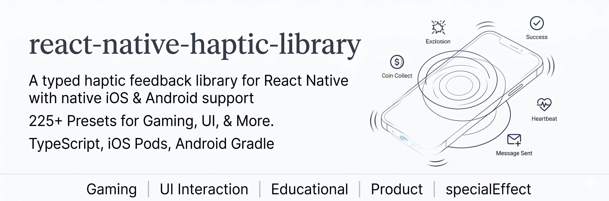

# @ayberkmogol/react-native-haptic-library

A React Native haptic feedback library with a typed preset API, native iOS playback, and Android vibration mappings.

## Web Playground

Explore the preset catalog and audition haptic patterns in your browser:

[https://ayberkmogol.dev/react-native-haptic-library/](https://ayberkmogol.dev/react-native-haptic-library/)

## Installation

```sh
npm install @ayberkmogol/react-native-haptic-library
cd ios && pod install
```

React Native autolinking loads the iOS pod and Android Gradle library automatically. Android consumers must allow the merged `android.permission.VIBRATE` permission, which this library declares in its manifest.

## Quick Start

```ts
import { Haptics, Presets } from '@ayberkmogol/react-native-haptic-library';

Presets.success();
Presets.coinCollectSingle({ duration: 0.15 });
Haptics.play('explosionMassive', { duration: 1.8 });

Haptics.prepare(['success', 'coinCollectSingle']);
Haptics.setEnabled(true);
Haptics.stop();
```

## Haptic Categories

The library ships 225 named presets grouped by interaction intent. Use the `Presets` helpers for autocomplete, or pass the same names to `Haptics.play(name)`.

| Category | Count | Example presets |
| --- | ---: | --- |
| Basic Haptics | 9 | `selection`, `soft`, `rigid`, `light`, `medium`, `heavy`, `success`, `error`, `warning` |
| Gaming | 25 | `lightningStrikeQuick`, `coinCollectSingle`, `coinCollectJackpot`, `swordSlashHeavy`, `explosionMassive`, `machineGun` |
| Educational | 77 | `achievementUnlocked`, `levelUp`, `starRating`, `badgeEarned`, `perfectScore`, `lessonComplete` |
| UI Interaction | 41 | `doubleTapLike`, `messageSent`, `notificationPop`, `pullToRefresh`, `toggleSwitch`, `swipeAction` |
| Special Effect | 12 | `magicSparkle`, `waterDrop`, `specialEarthquake`, `laserBeam`, `typewriter`, `heartbeat` |
| Wellness | 8 | `breathingGuide`, `calmPulse`, `meditationBell`, `relaxationWave`, `zenNotification`, `timeWarning30s` |
| Productivity | 5 | `timerComplete`, `taskCheck`, `focusStart`, `breakReminder`, `productivityFocusReminder` |
| Finance | 4 | `paymentSuccess`, `paymentProcessing`, `transactionAlert`, `receiptSaved` |
| Emotional | 5 | `excitementBuild`, `disappointment`, `surprise`, `joy`, `anticipation` |
| Intense Gamification | 33 | `fireBurst`, `iceShard`, `earthquakeRumble`, `windTornado`, `thunderStorm`, `meteorImpact` |
| Ratings & Feedback | 4 | `starRating1`, `starRating3`, `starRating5`, `socialNotification` |
| Tools & Writing | 2 | `pencilWrite`, `eraserUse` |

```ts
Presets.paymentSuccess();
Presets.pullToRefresh();
Presets.fireBurst({ duration: 0.9 });
Haptics.play('breathingGuide');
```

Use `patternNames` and `patternMetadata` to inspect the full generated catalog at runtime.

## Example App

The repository includes a runnable React Native app in `example/` for trying every generated pattern on device.

```sh
npm install
npm --prefix example install

npm run example:start
npm run example:android
# or
npm run example:ios
```

The Android Gradle wrapper lives in the example app, which is the normal place for a React Native library consumer build:

```sh
npm run example:android:assemble
# equivalent to: cd example/android && ./gradlew :app:assembleDebug
```

The example app starts with haptic categories. Open a category to search, prepare, and play the presets in that group.

## API

- `Haptics.play(name, options?)` plays any generated preset by name.
- `Haptics.prepare(name | name[])` preloads native resources where supported.
- `Haptics.stop()` stops active haptics and releases prepared state.
- `Haptics.setEnabled(enabled)` toggles playback.
- `Haptics.isSupported()` reports whether native haptic playback is available.
- `Presets.<patternName>(options?)` exposes generated functions for every bundled haptic preset.

## Platform Notes

### iOS

The iOS implementation routes preset names to native UIKit feedback generators and CoreHaptics patterns on iOS 13+.

### Android

Android playback requires Android 8.0 / API 26 or newer and uses `VibrationEffect` equivalents for the bundled preset catalog. The engine prefers predefined system effects for basic feedback, primitive composition on Android 11+ when possible, amplitude waveforms on Android 8+, and timing waveforms as a final fallback. Device hardware variance means Android output can vary across manufacturers and OS versions.

This package intentionally does not ship a root-level Gradle wrapper. The Android library is compiled by the consuming React Native application; this repo's `example/android/gradlew` is provided for local development and verification.

## Development

Android preset data is generated from the vendored iOS CoreHaptics catalog:

```sh
npm run generate:android-patterns
```

The command compiles the Swift pattern catalog, exports each CoreHaptics pattern, writes `generated/core-haptics.patterns.json`, and refreshes the Android Kotlin catalog.

## Credits

Many of the bundled haptic preset ideas and CoreHaptics pattern definitions were adapted from [SwiftfulHaptics](https://github.com/SwiftfulThinking/SwiftfulHaptics) by SwiftfulThinking, which is available under the MIT license.
